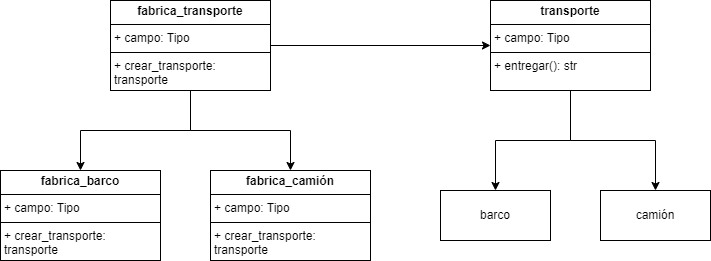

El patrón de diseño creacional Factory, también conocido como Factory Method, es un patrón que proporciona una interfaz para crear objetos en una superclase, pero permite a las subclases alterar el tipo de objetos que se crearán. Este patrón es útil cuando el proceso de creación de un objeto es complejo, requiere decisiones condicionales, o necesita flexibilidad para instanciar diferentes clases según el contexto.

### Principales Características del Patrón Factory:

1. **Encapsulamiento de la Creación de Objetos**:
   - La lógica para crear un objeto específico se encapsula en un método, conocido como método de fábrica o `factory method`.
   
2. **Delegación a Subclases**:
   - Las subclases se encargan de implementar el método de fábrica y devolver instancias de clases específicas.

3. **Desacoplamiento**:
   - El código que utiliza los objetos no necesita conocer las clases específicas que se instancian, solo la interfaz o clase abstracta común.

### Componentes del Patrón Factory:

1. **Producto (Product)**: 
   - La interfaz o clase abstracta que define el tipo de objeto que será creado.
   
2. **Producto Concreto (ConcreteProduct)**:
   - Implementaciones específicas del producto.
   
3. **Creador (Creator)**:
   - Una clase que declara el método de fábrica (`factory method`) que devuelve objetos del tipo `Product`. Puede ser una clase abstracta o una clase con una implementación predeterminada.
   
4. **Creador Concreto (ConcreteCreator)**:
   - Subclases del `Creator` que sobrescriben el método de fábrica para crear instancias de `ConcreteProduct`.

### Ejemplo:

### Ventajas del Patrón Factory:

1. **Mayor Flexibilidad y Extensibilidad**:
   - Permite agregar nuevos tipos de productos sin cambiar el código cliente.
   
2. **Reducción del Acoplamiento**:
   - El código cliente no depende de las clases concretas de los productos.

3. **Reutilización del Código**:
   - El código que crea los productos se centraliza y reutiliza.

### Desventajas del Patrón Factory:

1. **Complejidad Adicional**:
   - Puede introducir una complejidad adicional en la estructura del código.

2. **Más Clases**:
   - Aumenta el número de clases en el sistema.

El patrón Factory es muy útil en sistemas donde los tipos exactos de objetos que necesitan ser creados pueden variar y deben ser determinados en tiempo de ejecución. Este patrón permite que las decisiones de creación de objetos sean fácilmente manejables y extensibles.