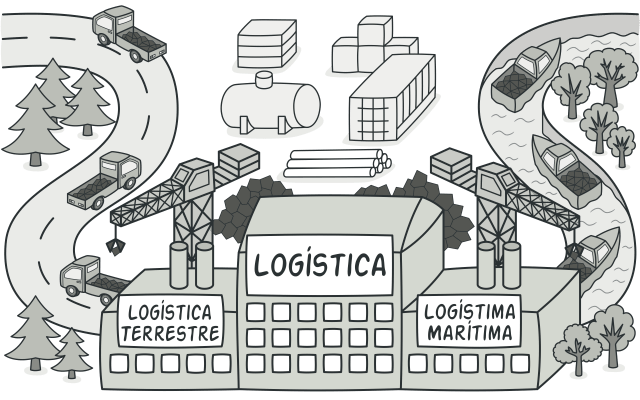

# Imlementación de factory en python



## Product.py

```python
from abc import ABC, abstractmethod

class Vehicle(ABC):
    @abstractmethod
    def deliver(self):
        pass

class Car(Vehicle):
    def __init__(self, model) -> None:
        self.model = model

    def deliver(self) -> str:
        return f'Auto {self.model} entregado'
    
class Truck(Vehicle):
    def __init__(self, model) -> None:
        self.model = model

    def deliver(self) -> str:
        return f'Camión {self.model} entregado'
```

### Explicación del Código:

#### Clase Abstracta `Vehicle`

```python
from abc import ABC, abstractmethod

class Vehicle(ABC):
    @abstractmethod
    def deliver(self):
        pass
```

Esta parte del código define una clase abstracta llamada `Vehicle`, que hereda de `ABC` (Abstract Base Class). La clase `Vehicle` contiene un método abstracto `deliver()`, declarado con el decorador `@abstractmethod`. Este decorador indica que cualquier subclase de `Vehicle` debe proporcionar una implementación concreta del método `deliver()`. El propósito de esta clase abstracta es establecer una interfaz común para todos los tipos de vehículos que se crearán.

#### Clase `Car`

```python
class Car(Vehicle):
    def __init__(self, model) -> None:
        self.model = model

    def deliver(self) -> str:
        return f'Auto {self.model} entregado'
```

La clase `Car` es una subclase concreta de `Vehicle`. 

- **Constructor (`__init__`)**:
  - El constructor `__init__` toma un argumento `model` y lo asigna a un atributo de instancia `self.model`.
  - Este atributo `model` representa el modelo del coche.

- **Método `deliver`**:
  - El método `deliver` devuelve una cadena de texto que indica que el coche con el modelo específico ha sido entregado. Este método sobrescribe el método abstracto `deliver` de la clase `Vehicle`.

#### Clase `Truck`

```python
class Truck(Vehicle):
    def __init__(self, model) -> None:
        self.model = model

    def deliver(self) -> str:
        return f'Camión {self.model} entregado'
```

La clase `Truck` es otra subclase concreta de `Vehicle`.

- **Constructor (`__init__`)**:
  - Similar a la clase `Car`, el constructor toma un argumento `model` y lo asigna a un atributo de instancia `self.model`.
  - Este atributo `model` representa el modelo del camión.

- **Método `deliver`**:
  - El método `deliver` devuelve una cadena de texto que indica que el camión con el modelo específico ha sido entregado. Este método también sobrescribe el método abstracto `deliver` de la clase `Vehicle`.


## Creator.py

El código comienza importando las clases abstractas necesarias del módulo `abc`, así como las clases `Car` y `Truck` desde un módulo llamado `product`. La clase abstracta `VehicleFactory` es definida para actuar como una fábrica de vehículos, encapsulando la lógica de creación de objetos de diferentes tipos de vehículos.

```python
from abc import ABC, abstractmethod
from product import Car, Truck
```

La clase `VehicleFactory` hereda de `ABC`, lo que la convierte en una clase base abstracta. Esta clase define un método abstracto `get_vehicle`, que toma un argumento `vehicle_type`. El decorador `@abstractmethod` se usa para indicar que cualquier subclase de `VehicleFactory` debe proporcionar una implementación concreta de este método. La intención es que las subclases de `VehicleFactory` implementen la lógica específica para instanciar diferentes tipos de vehículos (`Car`, `Truck`, etc.) según el valor de `vehicle_type`.

```python
class VehicleFactory(ABC):
    @abstractmethod
    def get_vehicle(self, vehicle_type):
        pass
```

## Concrete_factory.py

El código proporcionado define dos subclases de `VehicleFactory`: `CarFactory` y `TruckFactory`. Cada una de estas subclases implementa el método `get_vehicle`, que crea y devuelve instancias de `Car` y `Truck`, respectivamente. Aquí está la explicación en párrafos:

```python
from creator import VehicleFactory
from product import Car, Truck
```

El código comienza importando la clase `VehicleFactory` del módulo `creator` y las clases `Car` y `Truck` del módulo `product`.

```python
class CarFactory(VehicleFactory):
    def get_vehicle(self, vehicle_type):
        return Car(vehicle_type)
```

La clase `CarFactory` hereda de `VehicleFactory` y sobrescribe el método `get_vehicle`. Cuando se llama a este método con un tipo de vehículo, crea una instancia de `Car` con el tipo de vehículo proporcionado y la devuelve.

```python
class TruckFactory(VehicleFactory):
    def get_vehicle(self, vehicle_type):
        return Truck(vehicle_type)
```

Similarmente, la clase `TruckFactory` también hereda de `VehicleFactory` y sobrescribe el método `get_vehicle`. Cuando se invoca este método con un tipo de vehículo, crea una instancia de `Truck` con el tipo de vehículo dado y la devuelve.


## Client_code.py

El código que has proporcionado parece ser una función llamada `cliente_vehicle_code` que toma dos argumentos: una fábrica de vehículos (`factory`) y un tipo de vehículo (`vehicle_type`). La función utiliza la fábrica de vehículos para obtener un vehículo del tipo especificado y luego imprime el resultado de llamar al método `deliver()` en ese vehículo. Aquí tienes una explicación más detallada:

```python
from concrete_factory import CarFactory, TruckFactory
```

El código importa las clases `CarFactory` y `TruckFactory` del módulo `concrete_factory`. Estas son las fábricas concretas que crean instancias específicas de vehículos (coches y camiones).

```python
def cliente_vehicle_code(factory, vehicle_type):
    vehicle = factory.get_vehicle(vehicle_type)
    print(vehicle.deliver())
```

La función `cliente_vehicle_code` toma dos argumentos: `factory`, que es una instancia de una fábrica de vehículos (puede ser `CarFactory` o `TruckFactory`), y `vehicle_type`, que es una cadena que especifica el tipo de vehículo que se desea crear.

Dentro de la función, se llama al método `get_vehicle` de la fábrica pasándole el tipo de vehículo como argumento. Esto devuelve una instancia del vehículo deseado. Luego, se llama al método `deliver()` en este vehículo, que devuelve un mensaje indicando que el vehículo ha sido entregado. Finalmente, este mensaje se imprime en la consola.

## Main.py

Este código define dos fábricas concretas, `CarFactory` y `TruckFactory`, que heredan de la clase abstracta `VehicleFactory`. Cada fábrica implementa el método `get_vehicle` para crear y devolver instancias específicas de vehículos. Aquí está la explicación en párrafos:

```python
from creator import VehicleFactory
from product import Car, Truck
```

En esta sección se importan las clases necesarias: `VehicleFactory` desde el módulo `creator`, que es una clase abstracta que define la interfaz para la fábrica de vehículos, y las clases `Car` y `Truck` desde el módulo `product`, que son las clases concretas de los vehículos que se crearán.

```python
class CarFactory(VehicleFactory):
    def get_vehicle(self, vehicle_type):
        return Car(vehicle_type)
```

La clase `CarFactory` hereda de `VehicleFactory`, lo que significa que debe implementar el método abstracto `get_vehicle`. En esta implementación, cuando se llama al método `get_vehicle` con un tipo de vehículo específico, crea una instancia de `Car` con ese tipo y la devuelve.

```python
class TruckFactory(VehicleFactory):
    def get_vehicle(self, vehicle_type):
        return Truck(vehicle_type)
```

Similarmente, la clase `TruckFactory` también hereda de `VehicleFactory` y proporciona una implementación del método `get_vehicle`. Cuando se llama al método con un tipo de vehículo, crea una instancia de `Truck` con ese tipo y la devuelve.
