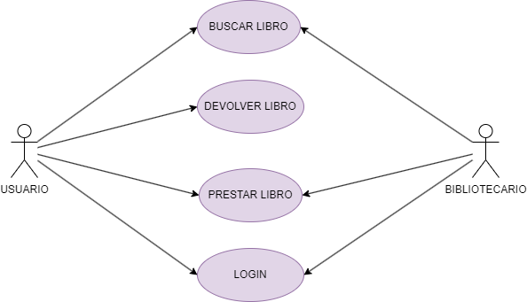

# Diagrama de comportamiento

En este ejercicio procederemos a analizar el diagrama de comportamiento de la siguiente imagen: 

## Actores

#### Bibliotecario

|  Actor | Bibliotecario |
|---|---|
| Descripción  | Sujeto que trabaja como un bibliotecario  |
| Características  | Empleado de una biblibioteca que se encarga de los clientes de la biblioteca |
| Relaciones | Login, buscar libro prestar libro  |
| Referencias | Realiza la búsqueda de libro, login y prestar libro|   
|  Notas |  No hay |
| Autor  | Lili Guo Zeng |
|Fecha | 21/01/2024 |

---
#### Usuario

|  Actor | Usuario |
|---|---|
| Descripción  | Sujeto que va a la bibliotecario  |
| Características  | Persona que va a la biblioteca para usar las instalaciones y recursos que presta la biblioteca |
| Relaciones | Login, buscar libro y prestar libro |
| Referencias | Devolver libro, prestar libro y login |   
|  Notas |  No hay |
| Autor  | Lili Guo Zeng |
|Fecha | 21/01/2024 |

## Casos de uso

#### Buscar libro

  |  Caso de Uso	CU | Buscar libro |
  |---|---|
  | Fuentes  | Sistema de una biblioteca  |
  | Actor  |  Bibliotecario y usuario  |
  | Descripción | Momento en el cual el se busca un libro y tanto el usuario como el bibliotecario pueden realizar la acción  |
  | Flujo básico | El usuario entra a la biblioteca para buscar un libro donde lo podrá encontrar en las estanterías clasificadas correspondientes al género del libro, sin embargo si no encuentra el libro este pedirá ayuda al bibliotecario |
  | Pre-condiciones | Debe estar el usario registrado en la biblioteca  |  
  | Post-condiciones  | Una vez encontrado el libro se tendrá que actualizar el estado del libro que va a ser prestado |  
  |  Requerimientos | Debe de estar registrado en la base de datos de la biblioteca  |
  |  Notas |  No hay |
  | Autor  | Lili Guo Zeng |
  |Fecha | 21/01/2024 |

---
  #### Devolver libro

  |  Caso de Uso	CU | Devolver libro |
  |---|---|
  | Fuentes  | Sistema de una biblioteca  |
  | Actor  |  Usuario  |
  | Descripción | Momento en el cual el se busca un libro y tanto el usuario como el bibliotecario pueden realizar la acción  |
  | Flujo básico | El usuario entra a la biblioteca para buscar un libro donde lo podrá encontrar en las estanterías clasificadas correspondientes al género del libro, sin embargo si no encuentra el libro este pedirá ayuda al bibliotecario. Asimismo, para que pueda ser prestado el libro el usuario tendrá que tener cuenta en la biblioteca para saber a quien se le está prestado y asigarle el día máximo de devolución. Una vez llegado el día máximo el usuario tendrá la responsabilidad de devolver el libro antes de el día máximo. |
  | Pre-condiciones | Debe estar el usario registrado en la biblioteca y además que la base de datos de la biblioteca se actualice y le dé una fecha máxima al usuario  |  
  | Post-condiciones  | El usuario deberá de devolver el libro antes del día indicado y además tendrá que devolverlo buenas condiciones |  
  |  Requerimientos | Debe de estar registrado en la base de datos de la biblioteca  |
  |  Notas |  No hay |
  | Autor  | Lili Guo Zeng |
  |Fecha | 21/01/2024 |

---
#### Prestar libro

  |  Caso de Uso	CU | Prestar libro |
  |---|---|
  | Fuentes  | Sistema de una biblioteca  |
  | Actor  |  Usuario y bibliotecario  |
  | Descripción | Acto en el que el usuario quiere que le presten un libro y el bibliotecario tiene que realizar la operación de el péstamo en la base de datos  |
  | Flujo básico | El usuario entra a la biblioteca para buscar un libro donde lo podrá encontrar en las estanterías clasificadas correspondientes al género del libro, sin embargo si no encuentra el libro este pedirá ayuda al bibliotecario. Asimismo, para que pueda ser prestado el libro el usuario tendrá que tener cuenta en la biblioteca para saber a quien se le está prestado y asigarle el día máximo de devolución |
  | Pre-condiciones | Debe estar el usario registrado en la biblioteca |  
  | Post-condiciones  | El usuario deberá de devolver el libro antes del día indicado y además tendrá que devolverlo buenas condiciones |  
  |  Requerimientos | Debe de estar registrado en la base de datos de la biblioteca  |
  |  Notas |  No hay |
  | Autor  | Lili Guo Zeng |
  |Fecha | 21/01/2024 |

  --- 
  #### Login

  |  Caso de Uso	CU | Login |
  |---|---|
  | Fuentes  | Sistema de una biblioteca  |
  | Actor  |  Usuario y bibliotecario  |
  | Descripción | Acto en el que el usuario se registra en la base de datos para crearse una cuenta con la que poder identificarse y poder prestar libros |
  | Flujo básico | El usuario se registra en base de datos de la biblioteca y se identifica con sus datos, el administrador que en este caso es el bibliotecario registrará todos estos datos y dará pie a la creación de la cuenta. |
  | Pre-condiciones | El usuario debe de entregar sus documentos de identidad y datos |  
  | Post-condiciones  | El usuario una vez registrado podrá realizar los préstamos de libros |  
  |  Requerimientos | Tarjeta de identidad y foto  |
  |  Notas |  No hay |
  | Autor  | Lili Guo Zeng |
  |Fecha | 21/01/2024 |