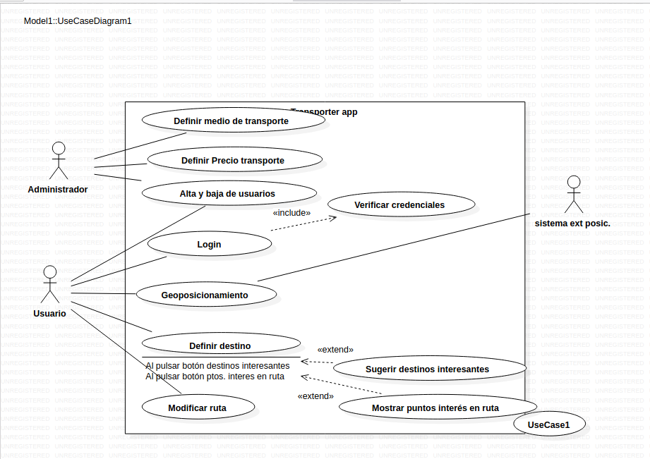

# Diagrama de comportamiento

En este ejercicio procederemos a analizar el diagrama de comportamiento de la siguiente imagen: 

## **Nombre de caso de uso**: 
En este caso estaremos tratanto de un app en la cual el administrador deberá definir el medio de transporte, el precio, entre otras cosas. Asimismo, el usuario deberá de crearse una cuenta, geoposicionamiento, definir el destino y modificar la ruta.

## **Descripción**: 
- Administrador: Este se encargará de administrar todo lo que respecta el precio, el tipo de vehículo además de las bajas y el alta de los usuarios.
- Usuario: El usuario se encaergará de al igual que el administrador de darse de alta y baja, el acceso en ella, el geoposicionamiento, definir el destino al cual quiere ir y la modificación de la ruta.
- Sistema externo de posicionamiento: Además existirá este sistema que lo que hará es localizar al usuario para poder adaptar mejor sus rutas.

## **Flujo de evento**
Esta app tratará de que el usuario que requiera de la utilización de esta permita un reocrrido óptimo hacia su destino. Esto tratará en que el usuario tendrá una cuenta en la que deberá de indicar sus datos personales, una vez hecho esto deberá de indicar la localización y hacia donde se dirige. Una vez hecho esto, los administradores con esta información buscarán todas las alternativas que tiene el usuario para llegar a su destino, recavando información sobre las rutas, vehículos etc. El usuario por tanto podrá elegir cual es la más óptima elección para él, pudiendo elegit en base a el precio, el tipo de vehículo, cercanía etc. 

## **Flujo Básico**
El usuario se registra en la app, seguidamente pone su geolocalización y a donde quiere ir, esta información es procesada por la app donde tendrá toda la información de vehículos y precios. Seguidamente la app trazará varias rutas con diferentes métodos por los cuales el usuario pará llegar a su destino.

## **Flujo aleternativo** 
La app no porá funcionar bien si el usuario no pone bien su localziación, además de que si el usuario no tiene burna señal de internet no podrá cargar la información de la aplicación.

## **Requisitos especiales**
Algunos de ellos son los legales y reguladores de la trata de datos de los usuarios al igual que su exposición de la geolocalización. También hay que tener en cuenta que los transportes que utilicemos en caso de ser un transporte público tendrán sus propios horarios y restricciones. La app además tiene que ser fiable por lo dicho anteriormente, ya que tiene que estar actualziada por parte de los horarios del transporte público como otros.

## **Condiciones previas**
Para poder lanzar la app, esta tiene que cumplir con todo lo que promete y estar actualziada, además de que tiene que se rde un uso intuitivo para que el usuario sepa como utilizarla.

## **Condiciones posteriores**
Lanzada ya la app, la app tendrá que poder mantener en un historial los usos que le has dado y el registro del usuario.

